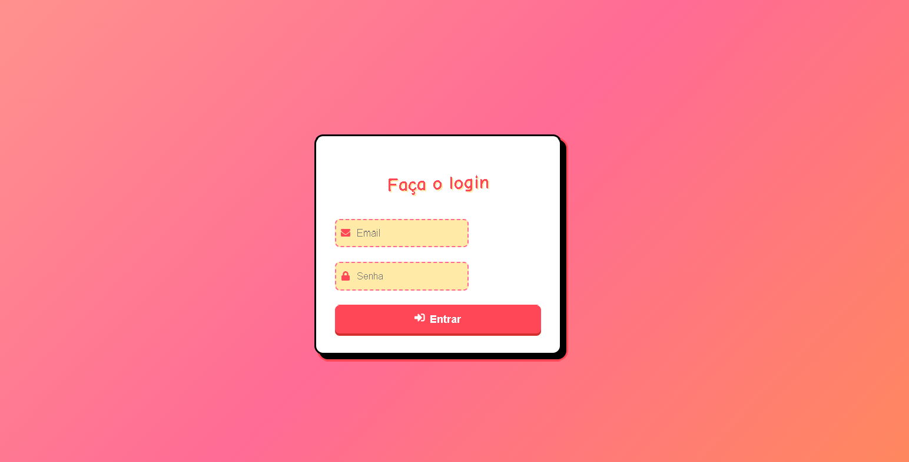
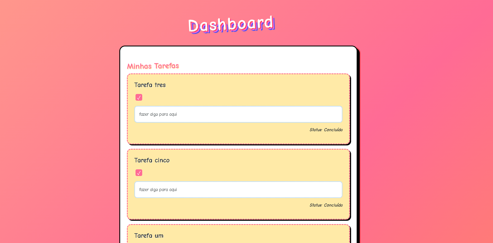

# ToDo App - Fullstack (Spring Boot + React + TypeScript)

Este projeto é uma aplicação de lista de tarefas (ToDo) com autenticação JWT, onde usuários podem se registrar, fazer login e gerenciar tarefas. Ele é dividido em duas partes:

* Backend: Spring Boot (Java)
* Frontend: React com TypeScript (Vite)


---
##  Telas
<div style="display: flex; gap: 20px; justify-content: center;">
  <figure>
    
    <figcaption style="text-align: center; font-weight: bold;">Login</figcaption>
  </figure>
  <figure>
    
    <figcaption style="text-align: center; font-weight: bold;">Dashboard</figcaption>
  </figure>
</div>

---

## Tecnologias Usadas

### Backend

* Java 17
* Spring Boot
* Spring Security com JWT
* Spring Data JPA
* PostgreSQL
* MAVEN

### Frontend

* React 18
* Vite
* TypeScript
* Axios
* Context API (para autenticação)
* CSS Modules
* tanstack/react-query

### Outros
- Docker & Docker Compose
---

##  Como Rodar o Projeto

### Requisitos

* Node.js (v18+)
* Java 17+
* Maven
* Docker
---

### 1. Clone o repositório

```bash
https://github.com/LuisNunes301/todo-java-react
cd todo-java-react
```

### 2. Rodar o Backend (Spring Boot)

```bash
cd backend  # ou o nome da pasta onde está seu backend
mvn spring-boot:run

```

O backend subirá na porta `http://localhost:8080`

---

### 3. Rodar o Frontend (React)

```bash
cd frontend
npm install
npm run dev
```
---

O frontend rodará na porta `http://localhost:5173`

## 4. Rodando como aplicação Docker

Antes de rodar o docker-compose, crie um arquivo `.env` na raiz com o seguinte conteúdo:

```
POSTGRES_DB=tasks
POSTGRES_USER=postgres
POSTGRES_PASSWORD=admin

SPRING_DATASOURCE_URL=jdbc:postgresql://postgres:5432/tasks
SPRING_DATASOURCE_USERNAME=postgres
SPRING_DATASOURCE_PASSWORD=admin
```

Depois, execute:
```bash
docker-compose --env-file .env up --build
```
---

## Rotas da API (Backend)

### Auth

| Método | Rota             | Descrição               |
| ------ | ---------------- | ----------------------- |
| POST   | `/auth/login`    | Login com email e senha |
| POST   | `/auth/register` | Criação de novo usuário |

**Payload - /auth/login**

```json
{
  "email": "teste@exemplo.com",
  "password": "123456"
}
```

**Payload - /auth/register**

```json
{
  "name": "Usuário Teste",
  "email": "teste@exemplo.com",
  "password": "123456"
}
```

### Task

Todas as rotas abaixo exigem autenticação via token JWT.

| Método | Rota          | Descrição              |
| ------ | ------------- | ---------------------- |
| GET    | `/tasks`      | Lista todas as tarefas |
| POST   | `/tasks`      | Cria nova tarefa       |
| PATCH    | `/tasks/{id}` | Atualiza uma tarefa    |
| DELETE | `/tasks/{id}` | Remove uma tarefa      |

**Exemplo de Payload para criação/edição**

```json
{
  "title": "Estudar Spring Boot",
  "description": "Assistir aula 03 do curso",
  "completed": false
}
```

---

## Estrutura de Pastas

### Backend (`/backend`)

```
com.todo.api
├── controllers       # Controllers REST
├── domain            # Entidades (task, user)
├── dto               # DTOs de entrada/saída
├── infra
│   ├── cors
│   └── security      # JWT + autenticação
└── repositories      # Spring Data
```

### Frontend (`/frontend`)

```
src
├── api               # Configuração do Axios
├── auth              # Contexto e rota protegida
├── components/task   # Componente Task
├── hooks             # Custom hook (useAuth)
├── pages             # Login e Dashboard
├── App.tsx           # Definição das rotas
```

---
##  Autenticação

* JWT salvo no `localStorage`
* `axios` intercepta automaticamente e envia o token em cada requisição privada
* Rota `/dashboard` protegida por `ProtectedRoute.tsx`
---
## Licença

MIT
